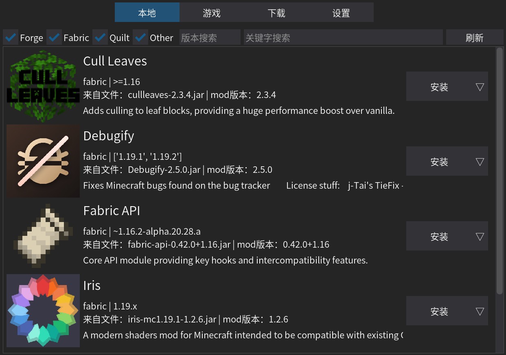

# RIKA! Minecraft Mod Manager

- 一个 Minecraft mod 管理器

---

## 功能速览

已实现功能：

- 本地 mod 仓库
- 依赖检查

计划功能：

- 版本更新检查
- mod 标记、分组
- 一站式 mod 下载
- 名称与介绍的中英文对照

## 关于项目

GUI 界面采用 [DearPygui](https://github.com/hoffstadt/DearPyGui) 开发

运行 src/main.py 文件启动
